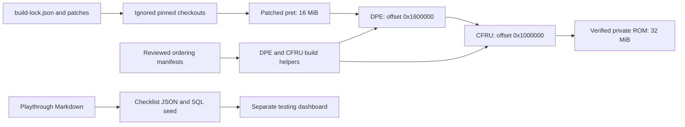

# Architecture and Reproducible Build

## Pipeline

This repository orchestrates a pinned three-stage binary build:

1. `pret/pokefirered` supplies the 16 MiB FireRed build; the tracked Legendary overlay changes seven event opcodes without moving data.
2. DPE expands species, forms, moves, graphics, and data tables at offset `0x1600000`.
3. CFRU adds runtime mechanics and is inserted at offset `0x1000000`.

Tracked overlays under `patches/` are applied to ignored upstream checkouts by `scripts/apply_overlays.py`. `build-lock.json` records upstream commits, offsets, overlay hashes, and output checksums. Generated ledgers under `data/` are audit inputs, not ROM assets.



## Ownership and generated files

| Location | Role | How to change it |
|---|---|---|
| `build-lock.json`, `patches/` | Upstream pins, ordered overlays, binary contracts | Review an overlay and its hash together; retain fixed offsets and stage checks. |
| `scripts/`, `tests/` | Orchestration, generators, audits, regression tests | Change the tracked implementation, then run its focused checks. |
| `data/build_order/` | Reviewed source/asset order and baseline DPE padding | Deliberate edits only; follow the manifest procedure below. |
| Other `data/` ledgers | Acquisition, evolution, forms, provenance, and gameplay contracts | Distinguish generator output from hand-maintained inputs before editing. |
| `.upstream/` | Pinned source with overlays and generated headers applied | Recreate from pins and overlays; do not rely on local-only source edits. |
| `.tools/`, `.venv/`, `base-rom/`, `build/`, `dist/` | Local dependencies, inputs, reports, private outputs | Keep ignored; no contributor should need another developer's absolute paths. |
| `docs/` | Current status, contracts, procedures, observations, history | Keep current evidence in status/testing and old claims in history. |
| `test-dashboard/`, `supabase/` | Separate browser/backend testing service | Checklist JSON and seed SQL derive from the playthrough Markdown; deployment is a separate operation. |

The Form Lab/Preserve generator derives `data/form_routes.csv` and the ignored CFRU generated header together. The habitat generator likewise produces a header and reconciles its ledger. Generated runtime headers are also materialized by the relevant overlays, so a prepared fresh checkout can run generator `--check` commands without regenerating tracked data.

M3 owns offline evolution routes, M4 National Dex availability, M5 permanent forms/quests/encyclopedia UI, M6 the preserved Contrary starter port, M7 optional DexNav migrations, and M8 release packaging and QA.

M5's authoritative 442-form contract generates the Form Lab family table and Form Preserve encounter table. M7 independently generates nine compact National Dex migration pools and injects one representative into DexNav without changing wild encounter headers. Expanded-save variable `0x515A` stores only the selected M7 group.

## Exact upstream pins

| Component | Commit | Offset |
|---|---|---|
| `pret/pokefirered` | `c75f352304d529f6ba92d4f74b9cf8b5c3810788` | n/a |
| `grilokapu/Dynamic-Pokemon-Expansion-Gen-9` | `376849ea0887131689a36cc51846c573f7735f22` | `0x1600000` |
| `Shiny-Miner/CFRU-expansion` (`Experiments`) | `dade256a1db1fa036fedd9f8566cb48de405e97a` | `0x1000000` |

CFRU's follower sprite insertion reported `0x900000`. This generated value is retained as build metadata. CFRU recommends the pinned grilokapu DPE fork and warns against Leon's ROM base.

## Reproduction

Pristine FireRed has SHA-1 `41cb23d8dccc8ebd7c649cd8fbb58eeace6e2fdc`. The pipeline's `vanilla` lock entry describes the **patched pret stage**, whose SHA-1 is `76ce183f8982f9accb9535a6f6e709cf44196b58`. They are intentionally different: the latter includes seven same-size opcode swaps. In each ignored expansion checkout, `BPRE0.gba` is the preceding verified stage artifact and is never tracked.

After provisioning tools and applying the declared overlays, run these from the orchestration root:

```sh
.codex/run-audits.sh
BUILD_JOBS=4 .codex/build-and-verify.sh
```

`scripts/build_pipeline.sh` supplies DPE/CFRU's compiler, assembler, graphics/audio utilities, and FreeImage paths. Activate the prepared Python environment before running it. Audits compare generated ledgers without rewriting them; regeneration is an explicit contributor operation.

Python 3.14.4 succeeded. CFRU required Pillow 12.3.0 and the tracked `-ffreestanding` compatibility overlay, which prevents GCC 14 from replacing CFRU's private string loop with an unresolved hosted-libc `strlen`; it does not change gameplay data.

Run `BUILD_JOBS=4 ./scripts/build_pipeline.sh` from the project root to verify locks and reproduce the vanilla → DPE → CFRU result. M3 overlays add the Celadon Link Cable listing, reusable Link Cable behavior, Alolan Raichu's Shiny Stone route, and missing Gholdengo/Maushold runtime methods. CFRU overlays `0015`–`0018` generate canonical Form Lab data, complete Evolution Guide formatters, bind Form Preserve encounters, and integrate the DexNav migration selector.

The pret stage is a fixed-layout binary input to CFRU's absolute byte replacements. `scripts/verify_build_artifact.py` therefore checks every stage's locked digest, the seven layout-preserving Legendary event opcodes, and the boot-critical eight-byte sound-initialization window at ROM offset `0x1DD0C8`. The Legendary recovery overlay changes only same-size `setflag`/`clearflag` opcodes; inserting or deleting event commands would move later ROM data and is not permitted by this contract. CFRU's image-build overlay also zeros only the unused one-to-three-byte tail after each complete GBA LZ77 stream, eliminating uninitialized `grit` padding from clean-build digests without changing decompressed graphics.

## Deterministic order and padding

DPE overlay `0003` and CFRU overlay `0021` route file discovery through `scripts/ordered_build_inputs.py`. JSON manifests retain the sequence that produced the locked artifacts; an alphabetical sort would move linked data and change the ROM. Discovery must exactly match the manifest's relative paths, including generated files at the point they are consumed. Unknown patterns, missing files, unexpected files, duplicates, and paths escaping the checkout fail explicitly.

DPE sprite assembly also passes through `scripts/grit_lz_padding.py`. It preserves the reviewed nonzero unused tails from `data/build_order/dpe_lz_padding.json` and zeros other recognized tails. Compressed input bytes are preserved. CFRU continues to use its existing zero-tail overlay. CFRU overlay `0022` captures three historical Urshifu flag aliases that previously existed only in a local checkout.

To change a manifest:

1. Identify the intentional source or asset addition/removal and its consuming glob group. Do not regenerate the order from the current filesystem.
2. Preserve the relative order of existing entries; add or remove only reviewed paths. Let the build regenerate derived sources before validating their groups.
3. Run `python3 -m unittest discover -s tests -v`, overlay validation, and the affected full stage build in an isolated checkout.
4. For tooling-only changes, require every stage/payload digest to remain unchanged. For a separately authorized gameplay change, investigate binary differences and record new runtime evidence before proposing replacement hashes.

Keep the padding manifest as a baseline artifact contract. A changed symbol or padding length requires review of the associated graphics input and resulting binary; it is not a reason to blindly accept new digest values.

## Compatibility and artifact policy

DPE documents save-block and TM/tutor expansion prerequisites when used without Complete FireRed Upgrade. Here DPE is immediately followed by pinned CFRU Expansion, which supplies those engine expansions. No separate prepatched ROM or Leon ROM base is used.

The combined output is a reproducible 32 MiB ROM. ROMs, saves, BIOS files, emulator states, local toolchains, contact sheets, and private patches remain ignored. Public distribution is limited to legal patches, source changes, scripts, locks, documentation, and credits.
